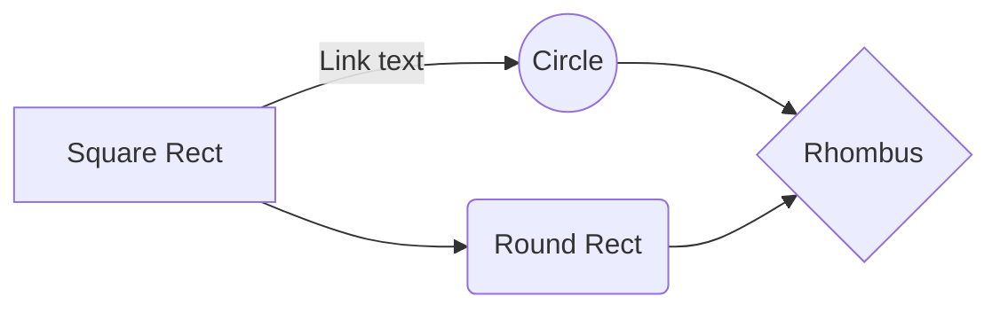

# hello-world
Test of Github. Learning about this tool...

**Some embedded java code:**
```java
if (target != true) {
  Object obj = new Object();
}
```

**A UML Diagram:**

```mermaid
graph LR
A[Square Rect] -- Link text --> B((Circle))
A --> C(Round Rect)
B --> D{Rhombus}
C --> D
```
